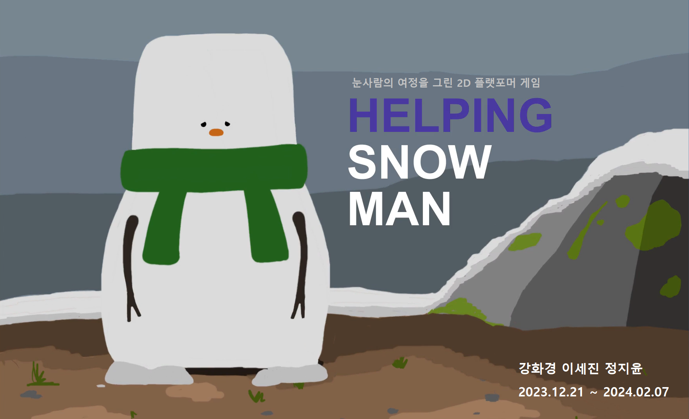

# ⛄ Helping Snowman

  

   

## 📌 프로젝트 소개

Helping Snowman은 **불완전한 눈사람을 도와 역경을 이겨내고 희망을 찾아가는 여정**을 그린 **Unity 기반 2D 플랫포머 게임**입니다.

눈이 내리는 겨울, 아이들이 만든 눈사람들 사이에서 유일하게 발이 없는 눈사람은 다른 눈사람들에게 무시당하며 외면받습니다.
플레이어는 발이 있는 평범한 눈사람이며, 발이 없는 눈사람에게 신발을 사주기 위해 썰매에 눈사람을 태워 이동하며 방해하는 적들을 물리치고 신발가게까지 안전하게 도착해야 합니다.

이 게임은 단순히 목적지에 도달하는 액션 게임을 넘어, 서로 다른 두 존재가 함께 위기를 헤쳐 나가고 희망을 찾아가는 과정을 통해 **‘함께하는 세상’**이라는 사회적 의미를 담고 있습니다.

   

## 👥 팀원 구성

| 이름 | 역할 |
|------|------|
| 강화경 | 맵 & 플레이어 |
| 이세진 | 보스 & 디자인 |
| 정지윤 | 에너미 & 아이템 |

   

## 🛠️ 기술 스택

  
  
  
  

   

## ⚙️ 개발 환경

| 항목 | 내용 |
|------|------|
| Engine | Unity 2021.3.21f1 |
| Language | C# |
| IDE | Visual Studio |
| Platform | PC |
| Version Control | Git / GitHub |
| Collaboration Tool | Notion, GitHub |

   

## 🧩 프로젝트 구조

Assets/
├── BossStage/
├── GameOverScene/
├── GameTitleScene/
├── GameWinScene/
├── Prefab/
├── Scenes/
├── Scripts/
├── Sprites/
├── TextMesh Pro/
├── TileMap/
├── img/
Packages/
ProjectSettings/
ScenePackage/

   

## 🎯 역할 분담

### 🧊 강화경 (맵 & 플레이어)
- 플레이어 이동 시스템 (점프, 구르기)
- 공격 시스템 (눈 던지기, 밟기)
- 맵 설계 및 지형 구성

### 🐻 이세진 (보스 & 디자인)
- 최종 보스 곰 구현
- 공격 패턴 설계 (내려치기, 포효, 꿀 공격)
- 보스 상태 변화 (광폭화) 구현
- 캐릭터 및 애니메이션 디자인

### 🐰 정지윤 (에너미 & 아이템)
- 토끼 및 곰 에너미 애니메이션 구현
- 충돌 처리 및 데미지 시스템 구현
- 플레이 테스트 기반 오류 수정 및 사용자 경험(UI/조작감) 개선
- 체력 회복 아이템 시스템 구현

   

## 📈 개발 과정

### 🧩 1주차
- 게임 아이디어 및 컨셉 기획
- 전체 스토리 방향 설정

### 🎨 2주차
- 캐릭터 및 맵 디자인 스케치
- 스토리 구체화

### ⚙️ 3주차
- 기능 설계 및 역할 분담
- 시스템 구조 정의

### 🛠️ 4주차
- 기본 이동 및 맵 구현
- 플레이어 컨트롤 시스템 개발
- 에네미 & 아이템 개발

### 🧟 5주차
- 에너미 및 충돌 처리 구현
- 아이템 기능 추가

### 🐻 6주차
- 보스 패턴 및 전투 시스템 구현
- 전체 게임 흐름 연결
- 애니메이션 추가

### 🚀 7주차
- 사운드 추가
- 시작 & 종료 애니메이션 씬 구현
- 버그 수정 및 최종 테스트
- 게임 완성

   

## 🕹️ 주요 기능

### 🎮 게임 구조

👉 **일반 스테이지 → 보스 스테이지**

- 일반 스테이지에서 이동 및 전투 진행
- 이후 보스 스테이지 진입, 보스를 클리어하면 게임 종료

 

### 🎯 플레이어

  

- 점프(↑) / 좌우이동(← →)
- 눈 던지기 공격(Z) / 대쉬(X)
- 피격 시 플레이어 몸 크기 감소, 체력 모두 소진 시 게임 종료

 

### 🧟 에너미

  

- 토끼: 점프하며 플레이어 방해, 곰: 좌우로 이동하며 플레이어 방해
- 충돌 시 데미지 처리, 공격 시 소멸

 

### 🐻 보스

  

- 공격 시 데미지, hp가 모두 닳아야 성공
- 다양한 공격 패턴
- 상태 변화 (광폭화)

 

### 🎁 아이템

  

- 눈 아이템 획득 시 체력 회복, 플레이어 몸 크기 증가

   

## 🎥 실행 영상

👉 [게임 실행 영상 보기](https://drive.google.com/file/d/1ZyOQjhBGOxMXDlbNEq9l8-VhCIugFmPN/view?usp=drive_link)

   

## 💾 빌드 파일

👉 [빌드 파일 다운로드](https://drive.google.com/file/d/1NK3X12h_25p_pCmchjQfNTtTqh2Vh5WZ/view?usp=drive_link)

압축 해제 후 `Helping Snowman.exe` 파일 실행하면 게임 플레이 가능

   

## 💡 회고 및 개선 방향

### 👍 회고
- Unity를 활용한 첫 팀 프로젝트 경험
- 게임 기획부터 구현까지 전체 흐름 이해
- 협업 및 역할 분담의 중요성 체감

### 🔧 개선 방향
- 애니메이션 및 UI 개선
- 난이도 밸런싱 조정
- 사운드 및 연출 강화
